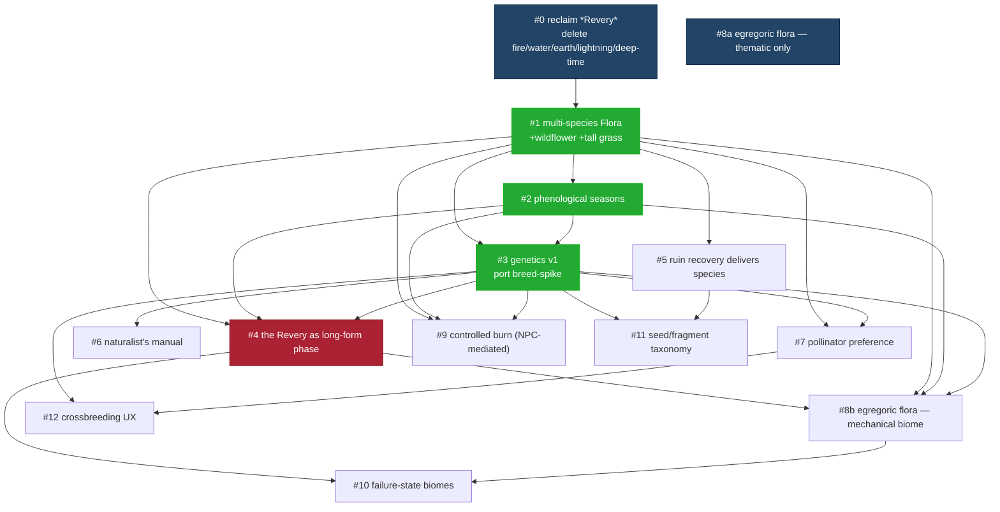

# Sequencing the precis: a three-PM debate

## Context

The précis (referenced as `backlog/precis.md`) lays out an ecological roguelike about stewardship and deep time — three nested loops (ruin expedition → ecological stewardship → the Revery), phenological seasons, partially-legible genetics, an evolving invasive biome, and failure as transformation.

The current build is mechanically solid but précis-thin: one species (clover), no seasons, no genetics, no invasive, no observation phase. The existing "deep-time revery" is a prototype to be subsumed — it is **not** the Revery the précis describes; the précis is bigger and better, and we're throwing the old framing away.

Separately: a sibling repo at `~/projects/breed-spike` worked out a hex-grid SHA256-as-genome model with dominance, mutation, and maternal mosaicism. That model is the genetics substrate for this game.

This document is a **sequencing plan**, not a code change. The deliverable is approval of the order. Each item, when picked up, produces its own `harness/specs/{id}.yaml` and `harness/plans/{id}.yaml` and goes through the normal harness pipeline.

**Two prerequisites for the implementer:**

- `backlog/precis.md` does not currently exist in the repo. Add it (or confirm where the canonical text lives) before #0 ships, since later specs will need to cite it.
- The `breed-spike` sibling repo is not reachable from CI / cloud sessions. #3 assumes its source is mirrored into this repo (e.g. under `vendor/breed-spike/` or copied into `src/engine/genetics/`) before work begins.

**Important vocabulary decision:** "Revery" now means _only_ the long-form phase of surrender (item #4). The four existing player-cast "reveries" (fire / water / earth / lightning) are being **removed**, not renamed. The précis frames the player as steward — they nudge conditions, they don't cast spells. The action bar survives but holds **tools and practices**, not spells. See item #0.

## The three PMs

- **Astrid** — vision purist. Defends précis themes literally. Believes a game with one plant cannot evoke ecological reverence.
- **Boon** — systems-first. Believes every loop should compound. Pushes simulation substrate before content built on top.
- **Calla** — player-experience pragmatist. Asks "what does the next session feel like?" Believes the Revery is the headline act.

## Dependency shape



## The debate, item by item

### 0. Reclaim _Revery_ — remove the four player-cast spells

Astrid P0 · Boon P0 · Calla P0

> **Astrid:** The précis is explicit: the player is "steward, participant, observer, temporary influence." Casting fire is not nudging. Drop the spells.

> **Boon:** From a systems angle, the spells today bypass the simulation. Fire-revery sets a tile alight; in a précis-true game, fire emerges from drought + lightning (during the Revery itself), or from a controlled burn the player initiates via the Torchbearer NPC (see #9). Water comes from weather. Soil is observed via the naturalist's manual (#6), not scanned by a spell. Lightning is weather, not a player ability. Keep the _underlying effects_; discard the cast UX.

> **Calla:** The tactile cast moments feel good — pushing back here. But that energy survives a translation: replace casting with **placing/tending**. "Lay a firebreak." "Carry water from the pond." "Scatter seed." Same dopamine hit, much stronger fit. The action bar slots stay; their contents become tools and practices.

**Consensus:** Delete `fire`, `water`, `earth`, `lightning`, `deep-time` from `src/engine/reveries.ts`. Reserve _Revery_ for #4. Action bar becomes a tool/seed/practice slotting UI.

**Concrete edits this item triggers** (so the spec author can scope the work):

- `src/engine/reveries.ts:13-60` — remove all five revery entries; keep the registry shape for future tool/practice slot defs or replace it outright.
- `src/engine/state.ts:367-374` — stop pushing `earth` / `lightning` / `water` / `deep-time` into `state.reveries` and the action bar at game start.
- `src/engine/characters.ts:36` — Moab's `gift: { kind: 'revery', id: 'fire' }` and Gron's `postGift: { id: 'deep-time' }` (granted via `interaction.ts:262-273`) need replacement gifts (an item, a recipe unlock, or simply no gift until #5/#9 land).
- `src/engine/actionBar.ts` — strip `applyReveryCastEffects`, `clearWaterReveryAura`, the `scan` / `aura` / `targeted` / `deepTime` cast branches in `activateActionBarSlot`, and `castLightningAtTarget`. Keep the slot scaffolding (`assignActionBarSlot`, `clearActionBarSlot`, `getSlotCooldownFraction`) and the `'item'` kind path.
- `src/engine/deepTime.ts` and `src/engine/lightning.ts` — the _simulation kernels_ survive (they're the substrate for #4 and for weather-driven lightning), but entry points called from the cast UX are deleted. Strip the `initiateDeepTime` call site; keep the tick code reachable from #4's new entry-condition trigger.
- Tests to update or delete: `src/engine/__tests__/state.test.ts:50,71`, `moab-colde.test.ts:144`, `gronDeepTime.test.ts`, `gron-gift.test.ts:61`, `wildfire.test.ts:124,163,199`, `starting-lightning-revery.yaml` spec, `lightning-revery.yaml` spec, `action-bar.yaml` spec (rewrite for tools/practices).
- Manual entries derived from reveries (via `manualDiscoveries: 'revery:fire'` etc.) — purge or replace in `src/engine/manual.ts`.

This is the first item to land because it's mostly _deletion_ and it clears the semantic deck for everything else.

**Replacement mapping for the player-feeling the old spells gave:**

| old spell                | replacement                                                                                                                                                    |
| ------------------------ | -------------------------------------------------------------------------------------------------------------------------------------------------------------- |
| fire revery              | **NPC-mediated controlled burn** (see #9) — the Torchbearer arrives at the seasonal burn window, the player instructs _where_; the NPC carries the drip torch. |
| water revery             | **Carry water** — fill a vessel at pond/river, walk to dry tiles. Or let rain handle it on its own schedule.                                                   |
| earth revery (soil scan) | Folded into the **naturalist's manual** (#6). Hover or inspect to observe soil health; no cast.                                                                |
| lightning revery         | Removed entirely. Lightning is a weather event during the Revery, not a player action.                                                                         |
| deep-time revery         | Subsumed into #4 — the Revery phase the prairie _enters_, not something the player triggers.                                                                   |

**Loop-headline symmetry (a useful frame that fell out of this debate):**

| loop                            | headline player act                                                                                      |
| ------------------------------- | -------------------------------------------------------------------------------------------------------- |
| small — ruin expedition         | recovering a seed / genetic fragment                                                                     |
| medium — ecological stewardship | instructing the Torchbearer on the controlled burn (once per cycle, narrow seasonal window, NPC ignites) |
| big — the Revery                | surrender + observe                                                                                      |

Each loop has one defining ceremonial moment. Everything else is the texture between them.

---

### 1. Multi-species flora (a Flora class, clover + 2 more)

Astrid P0 · Boon P0 · Calla P0

> **Astrid:** Precondition for everything. Genetics with one species is a spreadsheet. Pollinator preferences with one species is noise.

> **Boon:** Scope it to the _shape_ of a Flora class, not "ship 12 plants." Three species with different lifecycle parameters (bloom window, water need, soil preference). And the substrate is partially there — `src/engine/flora/` already has a registry pattern (`registerFloraMovement`, `registerFloraPollinate`), and clover already self-registers via `src/engine/flora/type/clover/clover.ts`. The `wildflowerSeeds`, `tallGrassSeeds`, and `milkweedSeeds` items already exist in `src/engine/items.ts:44-61` with nowhere to plant. That's the seam.

> **Calla:** Players feel this immediately. The carpet becomes a texture.

**Consensus: #1.** Generalize `src/engine/clover.ts` and `cloverLifecycle.ts` into a Flora module set keyed by tile-type (reusing the existing `flora/` registry pattern). Add wildflower + tall grass tile types in `src/engine/types.ts` alongside `TileType.Clover` / `BurntClover`. Port the lifecycle to a per-species parameter table.

---

### 2. Phenological seasons

Astrid P1 · Boon P0 · Calla P3

> **Boon:** Seasons are the substrate genetics needs. "Late blooming" only means something if there's a calendar that isn't a calendar. Derive from accumulated weather in `src/engine/weather.ts`; surface as a `season` field on `GameState`.

> **Astrid:** Cheap to fake well: a `Season` field derived from accumulated weather, surfaced subtly — UI tint, weather drift parameters, plant behavior bias.

> **Calla:** Invisible work unless plants visibly behave differently. Bundle it with #1's lifecycle.

**Consensus: #2, coupled to #1.** Adds `Season` to `GameState` (don't forget `harness/__tests__/serialization/schema.test.ts:EXPECTED_FIELDS`); plant lifecycle params in #1 read from it.

---

### 3. Genetics v1 — port the breed-spike model

Astrid P0 · Boon P1 · Calla P2

> **Astrid:** Genetics is the heart. The breed-spike work already nailed it — SHA256 → 8×8 hex grid, regions decode to phenotype, dominance via high-bit, recessive carrier status, maternal mosaicism, three mutation tiers.

> **Boon:** It's gold _as a substrate_. Reuse `breed-spike/src/engine/{genome,breed,mutations,regions}.ts` mostly intact. The work is mapping regions to _Flora_ phenotypes (bloom timing, cold tolerance, pollinator preference, fire response, drought response, seed count) instead of breed-spike's region map. **Prerequisite: mirror the breed-spike source into this repo before starting** — it's not reachable from cloud sessions.

> **Calla:** And we _don't expose the hex grid to the player by default_. The genome is real internally, but players see traits as discovered phenotypes in the manual ("suspected: late blooming"). The microscope-style inspection from breed-spike becomes a late-game tool.

**Consensus: #3.** Vendor breed-spike's engine into `src/engine/genetics/`. Adapt the region map for Flora trait set. Player-facing surface is the manual (#6), not the hex grid.

---

### 4. The Revery as the game's long-form phase (replace deep-time revery)

Astrid P0 · Boon P2 · Calla P0

> **Calla:** The précis Revery is the headline. We've been told: throw away the deep-time revery as a player-cast spell. The Revery is the _phase the prairie enters when ecological momentum builds_. It's not a button.

> **Astrid:** Right. The transition is phenological/ecological — once enough biomass + pollinator activity + season cycling accumulates, the prairie "stops waiting." Time accelerates. The player relinquishes direct control. They observe.

> **Boon:** Bigger than a normal feature — a phase-of-game thing. But the existing `src/engine/deepTime.ts` simulation has the bones (accelerated ticks, fire, weather, bee/clover updates) — reusable under #4's new entry conditions. Strip the player-cast revery framing (#0 already did the cast-side strip), wire entry to ecological state, build observation UX (camera drift, time-lapse, year counter, end-of-Revery summary).

> **Astrid:** Critically — the Revery must show _succession_, not just animation. Plants die, seeds disperse, traits drift, fire happens, pollinator routes shift. The whole point of #1/#2/#3 is so the Revery has something to _show_.

**Consensus: #4.** This is what the game becomes.

---

### 5. Ruin recovery as the species discovery loop

Astrid P0 · Boon P2 · Calla P1

> **Astrid:** "Ruins are memory structures within deep time." Right now they're mazes. Make them _worth_ visiting: the first non-clover species the player ever sees should be recovered from a ruin.

> **Calla:** This makes ruins the _acquisition_ loop instead of a sidebar.

> **Boon:** Start with one archetype — the `DormantGarden` archetype is already stubbed in `src/engine/ruins.ts:88-89` (currently the only archetype assigned). Its vault chamber and seed-decay timers exist; wire the vault payload to drop a wildflower/tall-grass seed (#1's new tile types). Don't build a puzzle layer yet.

**Consensus: #5.** Ships in the same release as #1 as the delivery vehicle.

---

### 6. Ecological knowledge UI (manual as naturalist's journal)

Astrid P1 · Boon P2 · Calla P1

> **Calla:** This is what makes #3 _playable_. Without "suspected: late blooming" appearing somewhere, the genetics is invisible.

> **Astrid:** Wire it into `src/engine/manual.ts` and `manualDiscoveries`. Plants get auto-generated entries; traits become discovered sub-entries. Same pattern as recipes today.

> **Boon:** Cheap on the existing `manualDiscoveries` system. Don't build a new screen.

**Consensus: #6.** Ships right after #3.

---

### 7. Pollinator routes & species preference

Astrid P2 · Boon P1 · Calla P2

> **Boon:** Bees today are collision-bonus and live in `src/engine/entities.ts` + `src/engine/flora/actions/pollinate.ts`. Précis wants "encourage pollinator routes." Bees should _prefer_ certain species/traits and visibly route between them. Small code, large feel.

> **Astrid:** Pollinator preference is the connective tissue between species and traits — a bee that prefers a bloom-window trait creates emergent selection pressure across Reveries.

> **Calla:** And it makes #4 visually narrative — routes shifting across years.

**Consensus: #7.**

---

### 8. Egregoric flora — _thematic now, mechanical later_

> Working term across spec, code, and dev docs. Player-facing word: **none** — see Round 3 lock-in below. The PM riffs that follow start with the word "invasive" because that's where the debate began; the consensus block at the bottom of this section drops it.
> Astrid P1 · Boon P2 · Calla P3

> **Astrid:** The précis is explicit: _parallel evolving alien ecosystem_. Not "weeds." Not "pests." A second ecology running on its own genetic substrate, its own pollinators, its own seasonal logic, intersecting the prairie's. The whole précis turns on this: stewardship is meaningful only if there's _another_ trajectory the land could be on. Without the invasive, this is a garden sim. With it, it's a contested edge.
>
> What I want the player to feel, first time they see it: a tile that _isn't quite right_. Glyph rendered in a palette they haven't seen — slightly off saturation, a color the prairie's seasons never produce. Movement that doesn't match the wind. The naturalist's manual returns "unknown" for it. Their existing knowledge framework doesn't catch.
>
> And the word matters. "Invasive" is the player's _eventual_ word — internal/scientific. The first character to mention it (Moab? a ghost?) should call it something else. "The other clover." "Whatever came down with the meteorite." Let the player earn the taxonomy. That's free worldbuilding.

> **Calla:** Astrid is right but I'd push back on one thing: the user said "doesn't have to materially impact the game yet." That's permission to do this _cheap_ in the early ship. So 8a is genuinely tiny — and here's exactly what tiny looks like:
>
> 1. One inert tile type — `TileType.AlienBloom` or similar — placed by genesis in ~3 spots on the map. Doesn't spread. Doesn't kill. Doesn't do anything. Just _is there_.
> 2. One manual entry that reads "unknown" until the player stands adjacent for N seconds → upgrades to "suspected: not native."
> 3. One dialog line from Moab (or a ghost) that gestures at it: "We don't know where those came from."
> 4. The existing meteorite item (`items.ts:26`) is the seed of the lore — recontextualize it as the carrier. Free continuity.
>
> That is the entire 8a. Five files, maybe a hundred lines. It ships in a week. And critically — **it ships before #4**, so when the Revery first happens, the player has _already noticed_ the alien tiles. The Revery accelerates time; if alien tiles spread during the Revery (even just from 3 to 6, as a hard-coded event), the player connects "the Revery is when the other ecology _moves_" without us having to build the mechanical biome yet. That's the cheapest possible payoff.

> **Boon:** Both right. Here's how I'd scope 8b when it lands.
>
> The mechanical invasive is a **parallel Flora species set** that reuses the #1 / #3 substrate with three deliberate asymmetries — the "one twist" I mentioned, but actually three because one twist is too little to feel different:
>
> 1. **Different genetics decoder.** Same SHA256 hex-grid substrate from breed-spike, but different region map. Native prairie species decode region-A → bloom timing, region-B → fire response. Invasive species decode the _same bits_ into different traits — region-A → spread velocity, region-B → herbicide resistance, region-C → something the native plants don't have an axis for, like _allelopathy_ (poisons soil for neighbors). This is the substrate honesty: invasive isn't a different game, it's a different reading of the same code.
> 2. **Different pollinator coupling.** #7 gives bees species preference. Invasives use a different pollinator — or they self-pollinate, or wind-pollinate. Either way, the player can't _encourage_ invasive routes by managing native pollinators. Bees won't carry their pollen. This breaks the player's main lever.
> 3. **Different seasonal phase offset.** If natives bloom in late spring, invasives bloom in early spring or late autumn — windows when the player's tools (#9 controlled burn) are out of season. The asymmetry is what creates strategy: you can only burn invasives by burning _with_ them during the prairie's vulnerable window.
>
> Cost-wise: if #1 and #3 are clean (one shared `FloraDefinition` shape, one shared genetics engine), adding the invasive species set is mostly data — two or three new species defs with different parameters, one new pollinator-preference entry, one new burn-response curve. Cheap. The expensive part is the _spread_ logic, which needs its own tick and its own balance pass. That's where 8b's M/L sizing comes from.

> **Astrid:** I want to add a thematic warning that should shape 8b. The invasive cannot become a _chore_. The précis is about reverence and surrender, not about pulling weeds for forty hours. If 8b ships as "destroy the bad plants before they win," we've built a tower defense and lost the game.
>
> The invasive should be something the player _witnesses across Reveries_, not something they micromanage per tick. Concrete implication: invasive spread happens predominantly _during_ the Revery (#4), not during stewardship phases. The player's stewardship-phase interaction with invasives is limited — observe, mark, plan, _maybe_ a single intervention like a controlled burn (#9) timed to the bloom window. The Revery is when the other ecology actually moves. The player wakes from the Revery to find the line has shifted.
>
> That framing turns the invasive into a _force of the deep time_, not an enemy. It's the asymmetric counterpart to the player's stewardship — both ecologies move during the Revery; only the prairie moves under the player's hand.

> **Calla:** I love that and it also solves a UX problem. If invasive spread only happens during the Revery, we don't need real-time spread visualization, threat indicators, alert popups — none of the noisy "your prairie is under attack" framing that would kill the tone. The Revery's end-of-phase summary screen ("here is what changed") naturally shows the invasive's progress as one diff among many.

> **Boon:** Agreed, and it folds neatly into the simulation budget. Per-tick invasive spread is expensive; per-Revery invasive succession is just `tickFloraGrowth` running on the invasive species set with its own parameters during the accelerated phase. Same kernel. We get this nearly for free once #4 exists.

> **Astrid:** One more thing — coexistence is a valid ending state, possibly the _intended_ one. The précis frames failure as transformation. A prairie that has been entirely overrun is not a game-over; it is one of #10's failure-state biomes (the "invasive bloom" prairie). A prairie that is half-and-half — native and invasive interleaved, both blooming on their phase-offset schedules, the player having found a stewardship rhythm that holds the line without erasing it — is a _good_ late game. The player's job isn't to win. It's to find a configuration they can live with.

> **Calla:** Which means the invasive isn't ever fully suppressible. There's no "clear" state. Even after a perfect controlled burn, a few tiles survive. Even after the player thinks they've got it stable, the next Revery shifts the balance. That's the on-tone version of "challenge" — not difficulty curves, but _persistence_.

---

#### Round two: the invasive is not-of-this-Earth

> **Astrid:** I want to push further on what the invasive _is_ in cosmology, because right now we've described it mechanically (parallel species set) but not ontologically. And the precis gives us the lever: the native flora use real-world genus/species names — _Trifolium repens_, _Asclepias syriaca_, real Latin binomials, the manual entries readable in any field guide. That naming anchors the prairie as a **fragment of Earth**. Which means the invasive isn't just "a different ecology." It is _not-Earth_. Wherever it came from is not here, and the line where they meet is the only line in the game that matters.
>
> Three candidate framings, in order of how on-tone I think they are:
>
> 1. **Pre-Earth / Post-Earth.** The invasives are what was here before the prairie, or what will be here after. The Revery isn't time accelerating — it's _the veil between Earths thinning_. Most melancholic, most precis-true. The player is tending a remnant; deep time is when the remnant briefly remembers it is a remnant.
> 2. **The Far Garden.** There is another garden, somewhere else, parallel cosmos, and its species occasionally cross into ours. The Far Garden's flora don't have species names because _naming is an Earth practice_. They have coordinates. Or numerals. Or glyphs that the manual can copy down but cannot pronounce. Most mythic, most legible to the player as "this is different."
> 3. **Meteoric / extraterrestrial in the literal sense.** Seeds in the meteorites (`items.ts:26`). Cleanest 8a hook — we already have meteorites on the map. But it tips toward sci-fi if we lean on it alone.
>
> I'd ship a _layered_ version: 1 is the deep truth, 2 is the in-fiction folk explanation that Moab and the ghosts give, 3 is the visible carrier the player observes. The meteorites fall where the veil is already thin. They are a symptom, not the cause. The player encounters them in reverse order — meteorite first (concrete), then "Far Garden" lore (mythic), then, deep into the game, the suggestion that the prairie itself is briefer than the thing pressing against it.

> **Boon:** I'll resist the gravitational pull of "more lore means more systems." Most of this should land in the _writing_ — manual entries, NPC dialog, end-of-Revery summaries — not in new mechanics. But there is one mechanical implication that genuinely follows from "not-of-this-Earth," and I think it's worth picking up because it cleans up an open design question.
>
> If the invasive is ontologically other, then **its genome is structurally different from native flora's**, not just numerically. Concrete proposal building on the breed-spike substrate:
>
> - Native species: SHA256 → 8×8 hex grid → region map A (the prairie's). Standard breed-spike.
> - Invasive species: same SHA256 substrate, **plus a second layer** the natives don't have. Could be additional hex grids, could be a different decoding of the same bits, could be a region that natives lack entirely (allelopathy, the trait Astrid's first riff mentioned). The shape of the data is different.
>
> The mechanical consequence is clean and player-legible: **crossbreeding between native and invasive cannot happen.** Not because we forbid it with a rule, but because there are no shared regions to align over. The manual entry, if a player tries, reads "no compatible regions." This forecloses one design path (`Native × Invasive → Hybrid`) in a way that _tells the cosmology through the data structure_. The otherness isn't a flag; it's the shape of the genome.
>
> This also makes #12 (crossbreeding UX) sharper: the player can crossbreed within the prairie freely, but the line between Earth-flora and not-Earth-flora is _genetically impassable_. That's the précis's "contested edge" rendered as a literal data boundary.

> **Calla:** This is where the player-feel work pays off. Three concrete UX moments that sell the mythicism without a single new subsystem:
>
> 1. **Glyph and palette.** Native flora uses ASCII glyphs (`%`, `·`, `*`) in the prairie's seasonal palette. Invasives use Unicode glyphs the game otherwise never touches — combining marks, geometric shapes, characters from BMP blocks we don't use elsewhere. And the color is _almost_ right — saturation slightly off, or a hue the prairie's seasons never produce. The visual otherness is typographic. Costs nothing.
> 2. **The manual's refusal.** When the player tries to identify an invasive, the manual entry isn't "unknown" — that's a mechanical placeholder, and it's wrong here. The entry is _malformed_. The Latin binomial line stutters: `T̷r̴i̶f̵o̶l̴i̷u̵m̴ ̶r̸e̸p̶...` — fails to settle. Or the page rendering glitches for one frame. Or it's literally blank where natives have prose. The naturalist's framework cannot catch this. **That is the most precis-true UI moment in the entire game.** The player's lens fails, and the failure is informative. Mechanically this is a single conditional in the manual renderer.
> 3. **The folk knowledge gap.** Moab does not explain the invasive. Neither do the ghosts. They _gesture_ at it with superstition. "We don't grow that." "Nothing grows that." "It was here before the grass." They refuse to name it. The taxonomy progression I proposed earlier ("the other clover" → "the spreading kind" → "invasive") still works, but the third stage isn't reached through gameplay — it's reached through the player's own internal naming. The game never confirms it. The manual never settles on a binomial. That refusal is the relationship.
>
> All three are writing-and-art work, not engineering. Boon's right that this lands in the words.

> **Astrid:** And it lets us name the failure-state biome in #10 with weight. The "invasive bloom" prairie isn't "the prairie that got overrun." It is **the prairie that became the Far Garden** — the moment when this fragment of Earth ceased being a fragment of Earth. That's not a fail state; it is a transformation into a different ontology. Per the précis: _failure is transformative_. The player who reaches that biome has been the steward of a small Earth's final passage into not-Earth. That is one of the most powerful endings the game can offer, and we get it almost for free by being precise about the cosmology.

> **Boon:** Last technical note. The "fragment of Earth" framing has implications for #2 (seasons) and #4 (the Revery) that we should flag now so the spec authors don't have to reverse-engineer them:
>
> - **Seasons** are an Earth thing. The prairie has Earth seasons. The invasive does _not_ respond to them the same way — its bloom triggers are something else (proximity to other invasives, accumulated Revery exposure, meteoric events). This is the phase-offset asymmetry from my round-one riff, but now grounded: it's not "different season parameters," it's "indifferent to seasons in the Earth sense." Mechanically the same; ontologically clearer.
> - **The Revery's end-of-phase summary** should include a new category beyond "what changed": **what arrived**. Invasive tiles can _appear_ during the Revery without spreading from an existing tile — they cross over from elsewhere. The summary frames this in the cosmology's voice: not "3 invasive tiles spread" but "the line moved."

> **Calla:** Closing thought. The mythical framing also fixes a tone problem I didn't fully name in round one. "Invasive species" in the real-world ecological sense carries a charge — colonial language, eradication framing, the wrong politics for a game about reverence. By making the invasive literally not-of-this-Earth, we step _out_ of that frame. It isn't a species the player is supposed to want gone. It's the _other ecology_, in the sense that the night sky is the other day. The player's relationship to it can be awe, dread, curiosity, mourning — but not the eradication impulse the word "invasive" otherwise primes. That's worth a lot.

---

#### Round three: the unnaming, and what a refused entry actually looks like

> **Astrid:** Then we should commit. The word _invasive_ doesn't appear in player-facing text at all — not in the manual, not in dialog, not in tooltips, not in the end-of-Revery summary. It's gone. The closest the game ever comes to a name is "the Far Garden" from NPCs in folk register, and even that's something Moab and the ghosts _say_ — never something the manual confirms. The naturalist's lens fails on these species by design. The unnaming _is_ the design.
>
> For the implementer's working vocabulary I want to propose **egregores** — Calla's reference is exactly right. In the occult tradition an egregore is a thoughtform that arises from collective minds and gains autonomous existence — a presence that is real but doesn't sit in the ontological register of nameable things. It resists taxonomy by its nature, not by accident. That's what these are. Working terms in specs, code, and dev docs: `egregoric flora`, `the egregores`, `TileType.Egregore`, etc. **Player-facing: refused.**

> **Boon:** I'll accept "egregore" as the working term — it's _useful_, not just evocative. Having a real word in spec discussions saves us from spending the next year writing "the not-Earth flora set" in every doc. And it's pre-loaded with the correct connotations, so spec authors arrive at the right design tone without me having to police it. Locking it in: working term **egregores**, player-facing word **none**.

> **Calla:** Good. Now the manual entry itself, in concrete detail, because this is where the unnaming has to _render_. The strong version isn't a stutter or a render glitch — those tip toward bug-aesthetic. The strong version is a manual page that has the **complete structure of a real naturalist's entry** but every field is _glossolalic_. Like a Voynich manuscript page: clearly _trying_ to be a botanical entry, evidently _failed_ to be one. The structure is what tells the player the framework reached for the thing and couldn't catch it.
>
> Concrete layout, mirroring how the manual renders _Trifolium repens_ today:
>
> ```
> ──────────────────────────────────
>   ⟆ ⟁⟇⟆⟁⟇⟆⟁
>   ◊◊◊◊◊◊◊◊◊  ◊◊◊◊◊◊◊◊◊
>
>   ⟇⟆ ⟁⟇⟆⟁⟇ ⟆⟁⟇ ⟆⟁⟇⟆⟁⟇⟆ ⟁⟇⟆⟁⟇⟆⟁⟇,
>   ⟆⟁⟇⟆ ⟁⟇⟆ ⟁⟇⟆⟁⟇⟆ ⟁⟇⟆⟁⟇⟆⟁⟇⟆⟁⟇⟆.
>   ⟆⟁⟇⟆⟁ ⟇⟆⟁⟇⟆⟁⟇⟆ — ⟁⟇⟆⟁⟇⟆⟁⟇⟆⟁⟇⟆.
>
>   ⟇⟆⟁⟇⟆⟁⟇⟆: ◊◊◊
>   ⟁⟇⟆⟁⟇⟆⟁⟇: ◊◊◊◊◊◊
>   ⟆⟁⟇⟆⟁⟇⟆⟁⟇⟆: ◊◊◊◊◊◊◊◊◊◊◊◊
> ──────────────────────────────────
> ```
>
> Implementation notes for the spec author:
>
> - The character set is a small, consistent alphabet of glyphs the game otherwise doesn't render — geometric shapes, combining marks, characters from a single chosen Unicode block (Miscellaneous Symbols, Geometric Shapes, or a constructed set). **Consistency matters** — these are _characters in a script we don't know_, not random noise. The player should sense they're looking at a _language_, not glitch text. That's the egregore register.
> - Word lengths and structure mirror Latin binomial layout — two "words" where a binomial would be, paragraph shape where the description would be, three labeled fields where natives have distribution / habitat / notes. Mimicry of taxonomy, refused at content.
> - **Stable per tile, varying across tiles.** Each egregoric tile's manual page renders the _same_ glossolalic text every time you open it (seeded by the tile's position or genome hash), but different tiles produce different glossolalia. This is critical: the player can almost-recognize patterns across pages — "I've seen that glyph before" — which lets them build private taxonomy the game never confirms. **No live shimmer, no per-frame churn.** The text doesn't move once rendered. Movement reads as bug; stillness reads as language.
> - One field, occasionally, settles. Rare — maybe one tile in five has a single readable English word buried in the otherwise-glossolalic description. Not enough to decode. Enough to suggest the failure isn't total. (A late-game ritual or tool might raise this rate, but never to legibility.)

> **Astrid:** That last point is the entire game in miniature. _Almost legible_ is the stewardship stance. The player accumulates fragments, builds private intuition, never receives confirmation. The manual that refuses to settle is the précis's central claim about knowledge, rendered as one screen.

> **Boon:** Two implementation cleanups so this lands without surprises:
>
> 1. The egregore glyph set used in tile rendering and the egregore glyph set used in manual entries should be the **same script**. One Unicode block, one stable alphabet, used everywhere these things appear. The map tile, the manual entry, the end-of-Revery summary, the (refused) tooltip — all drawn from one consistent script. This is how the player learns they're looking at "a language" without us ever saying so.
> 2. The "occasional readable word" in manual descriptions wants a tight allowlist of evocative single words — _threshold_, _between_, _garden_, _before_, _not_, _here_, _was_, _is_, _will_, _meteor_, _Earth_, _line_, _thin_, _near_. Single syllables, mostly. Vocabulary of cosmology and presence. Each tile picks zero or one from a seeded RNG. The implementer should not improvise this list — it should be a constant in code, reviewable, so that the _texture_ of accidental legibility stays coherent across the game.

**Consensus, framed by the cosmology and the unnaming:**

The prairie is a **fragment of Earth** — native flora carry real Latin binomials (_Trifolium repens_, etc.), confirmed by the manual. The egregoric flora is **not-of-this-Earth**: deep truth is "veil between Earths thinning during the Revery"; in-fiction folk explanation is "the Far Garden" (what NPCs say); visible carrier is meteoric (what the player observes). Player learns these in reverse order: meteorite → Far Garden lore → the veil framing as a late suggestion the game never confirms.

**Vocabulary lock-in:**

- **Working term (spec, code, dev docs):** `egregores` / `egregoric flora` / `TileType.Egregore`. Used freely in implementation discussion.
- **Player-facing term: none.** The word _invasive_ does not appear anywhere the player will read it — not in manual entries, dialog, tooltips, end-of-Revery summary, item descriptions, or settings. The closest the game comes to a name is NPCs' folk register ("the Far Garden," "the other clover," "we don't grow that"). The manual never confirms a name. The unnaming is the design.
- **Spec authors must hold this line in player-facing prose.** A spec that introduces the word _invasive_ in dialog or UI fails review.

**8a — thematic allusions (ships before #4):**

- One inert tile type (`TileType.Egregore` or chosen name) rendered in a glyph from a single chosen Unicode block the game otherwise doesn't use, in an almost-right palette.
- ~3 egregoric tiles placed by genesis on the overworld map, biased near meteorite spawns.
- Manual entry rendered in the **egregore register** — a Voynich-style page: complete naturalist's entry structure (binomial line, description paragraph, three labeled fields) with every field filled in glossolalic glyphs from a consistent constructed alphabet. Stable per tile (seeded by tile position), varying across tiles. No animation, no churn — stillness reads as language.
- Occasional readable single word buried in description prose — pulled from a small reviewable allowlist (`threshold`, `between`, `garden`, `before`, `not`, `here`, `was`, `meteor`, `Earth`, `line`, `thin`, `near` …). Roughly one tile in five has zero or one such word. Vocabulary of cosmology and presence.
- NPCs (Moab, at least one ghost) gesture at egregoric tiles with superstition and refuse to name them. Meteorite (`items.ts:26`) recontextualized as the visible carrier — meteorites fall where the veil is already thin.
- During the first Revery, a hard-coded event grows the egregoric tile count from 3 to ~6. End-of-Revery summary phrases this as _the line moved_, not as "3 tiles spread."

**8b — mechanical biome (ships after #4 + #7 + #9):**

Parallel Flora species set reusing #1/#3 substrate. Asymmetries:

- **Genome shape differs.** Same SHA256 base layer (so they occupy the same tiles and react to weather), plus a non-shared extension layer (regions natives lack — allelopathy, etc.). Crossbreeding native × egregore returns "no compatible regions" — the cosmological boundary rendered as a data-structure boundary. Forecloses one #12 design path cleanly.
- **Pollinator coupling differs.** Wind or self-pollination, not bees — the player's main lever (encouraging native pollinator routes via #7) doesn't reach the egregores.
- **Indifferent to Earth seasons.** Bloom triggers are something else — proximity to other egregoric tiles, accumulated Revery exposure, meteoric events. Phase-offset by design.
- **Spread happens primarily during the Revery, not in stewardship phases.** End-of-Revery summary surfaces a new category — _what arrived_ — phrased "the line moved" rather than "N tiles spread."
- **Coexistence is a valid long-run state**; full eradication is impossible by design. The corresponding failure-state biome in #10 is named **"the prairie became the Far Garden"** — not a fail state but a transformation into a different ontology.

**Naming progression (player experience, never confirmed by the game):**

- Pre-Revery: NPCs say "the other clover" or refuse the question. Manual entry exists but renders in the egregore register — the player can open it and see the page _not catching_.
- Post-first-Revery: NPCs and ghosts gesture at "the Far Garden." Manual entry remains in egregore register; the readable-word slot may _settle_ on a different word than before across multiple readings, but never enough to decode.
- Late game: the player has their own internal word for these. The game never offers one. The manual never settles on a binomial. That refusal is the relationship.

**Tone discipline.** "Invasive" carries colonial-ecology charge that primes eradication, and is dropped from player-facing text entirely (see vocabulary lock-in above). The mythical framing steps _out_ of that frame: this isn't a species to want gone, it is _the other ecology, in the sense that the night sky is the other day_. The player's relationship can be awe, dread, curiosity, mourning — not eradication.

**Critical files (8a):**

- `src/engine/types.ts` — new `TileType.Egregore` (working name) alongside `Clover` / `BurntClover`. Tile glyph drawn from the single chosen egregore script (one consistent Unicode block, used everywhere these things appear).
- `src/engine/genesis.ts` — place ~3 egregoric tiles during overworld generation, biased near meteorite spawns to seed the "carrier" reading.
- `src/engine/manual.ts` + `manualDiscoveries` — egregore-register entry renderer. Implementation shape: preserve the exact structural template of a native plant entry (header + binomial line + description paragraph + three labeled fields), substitute each field's content with glyphs sampled deterministically from the egregore script. Seed by tile position (or tile genome hash in 8b) so the page is _stable_ per tile and varied across tiles. No animation, no per-frame churn. Single optional readable English word per description, drawn from a constant allowlist (`threshold`, `between`, `garden`, `before`, `not`, `here`, `was`, `meteor`, `Earth`, `line`, `thin`, `near` …) at a ~1-in-5 rate.
- `src/engine/characters.ts` — Moab and at least one ghost get a refusal line ("We don't grow that" / "Nothing grows that" / "It was here before the grass"). They never name it. Player-facing prose must not contain the word _invasive_.
- `src/engine/items.ts:26` — meteorite description recontextualized to gesture at the carrier framing without confirming it.
- `src/engine/deepTime.ts` (after #4 lands) — hard-coded egregoric growth event during the Burning/Simulating phase, framed in the end-of-Revery summary as "the line moved."

**Critical files (8b):**

- `src/engine/flora/type/egregore/` — egregoric species defs under the existing flora registry (extends #1's seam). Species "names" in code are stable identifiers; player-facing labels remain in egregore register (the manual never resolves them).
- `src/engine/genetics/` — region map for the egregoric decoder, **plus extension-layer regions natives lack** (allelopathy, etc.). Crossbreeding gate in the breed function returns "no compatible regions" when native × egregore is attempted.
- `src/engine/flora/actions/pollinate.ts` + `src/engine/entities.ts` — pollinator coupling for egregores (wind or self-pollination); native bees ignore egregoric tiles.
- `src/engine/deepTime.ts` — per-Revery egregoric succession tick (reuses `tickFloraGrowth` kernel on the egregoric species set), plus the "what arrived" category in the end-of-Revery summary.
- New: end-of-Revery summary UI (built in #4) extended to surface egregoric diffs in the cosmology's voice — "the line moved" rather than "N tiles spread."
- `src/engine/manual.ts` — when #12 (crossbreeding UX) ships, the native × egregore attempt yields the "no compatible regions" message; this is the player-facing surface of the genome-shape asymmetry.
- **Lint guard (recommended):** add a CI check that flags the literal string `invasive` (case-insensitive) appearing in player-facing files (`dialog/*`, `manual/*`, UI strings) so the player-facing-word ban survives the long tail of future spec work.

---

### 9. Controlled burn as deliberate succession tool (Torchbearer NPC)

Astrid P2 · Boon P2 · Calla P2

> **Calla:** This is where the fire-revery dopamine moved to. The Torchbearer NPC arrives at the burn window's opening (late dormancy → early thaw) and departs when it closes — their presence _is_ the seasonal signal. The player instructs them: where to start the line, which area to burn. The NPC carries the drip torch; the player doesn't.

> **Boon:** Calibrated Dark Souls bumper (Pattern C): the NPC advises (warns about wind, humidity, missing firebreaks), mostly obeys (will light a bad burn if insisted — informative failure), refuses only at the catastrophic edge (extreme drought + wind, or burns that would consume beloved areas like the village). Botched burns produce ash prairie — an instance of #10's failure-state biomes — not a game-over. Reuses the surviving wildfire spread kernel in `src/engine/lightning.ts`.

> **Astrid:** Important for the anti-optimization theme — burns are lossy in ways that are sometimes generative. Replaces Moab's deleted fire-revery gift; Moab now teaches the player about the Torchbearer (or _is_ the Torchbearer).

**Consensus: #9.** Wildfire (emergent, drought + lightning during the Revery) is separate and is _not_ player-triggered.

---

### 10. Failure-state biomes (ash / fungal / Far Garden)

Astrid P1 · Boon P3 · Calla P2

> **Astrid:** "Failure is transformative." One of the most evocative passages in the précis.

> **Boon:** All downstream of #1, #2, #4, #8b. Sequence as _outcomes_ of other systems — what a Revery leaves behind — not standalone features.

> **Calla:** Agreed. Ash prairie falls out of a destructive Revery or a botched controlled burn (#9). Fungal and Far-Garden-conversion variants emerge once Reveries (#4) and the mechanical egregoric biome (#8b) have weight. The Far Garden biome's player-facing name is _never spelled out_; it appears in the manual in egregore register and in NPC dialog as "the line moved past us."

**Consensus: #10. Emerges from #4 + #8b + #9, not built standalone.**

---

### 11. Seed / genetic-fragment item taxonomy

Astrid P1 · Boon P3 · Calla P2

> **Astrid:** The précis vocabulary matters: seeds, dormant plants, pollinators, fungi, invasives, genetic fragments.

> **Boon:** Most collapse onto "seeds with a genome" once #3 lands. Don't proliferate item types prematurely — different _names_ for the same data shape.

> **Calla:** Vocabulary in the manual is cheap and strongly on-tone.

**Consensus: #11.** Ships as a renaming/extension of `src/engine/items.ts` after #3 + #5.

---

### 12. Crossbreeding UX (player-directed pollination)

Astrid P0 · Boon P1 · Calla P3

> **Astrid:** "Crossbreeds lineages, studies inheritance" — the long arc.

> **Boon:** With #3 ported, the _engine_ is done. What's missing is the player-facing crossbreeding _act_: place two plants adjacent and wait a season → child seed inherits via the breed-spike rules. Pollinator-mediated crossing (#7) is the on-tone version.

> **Calla:** Punt to after the Revery (#4) feels real. Otherwise we're modeling Mendel before the prairie feels alive.

**Consensus: #12.**

---

## Meeting with Delta

_Delta is the GM and the author of the précis. Strong opinions, loosely held — except where the précis is unambiguous, in which case loosely held in form only. Open to ideas; expects the team to have done the work before bringing them. The three PMs have been debating items 0–12 for two weeks and are presenting the synthesis._

_Conference room. Astrid has a stack of printouts. Calla has the egregore-register mockup on a tablet. Boon has the dependency DAG on the wall. Delta has coffee and the précis open on a laptop, unread for the last ten minutes._

> **Astrid:** I'll start with the headline. We're recommending you delete the four player-cast reveries — fire, water, earth, lightning — and reserve the word _Revery_ for the long-form phase. The précis is unambiguous about this: the player is a steward, not a wizard. Casting fire is not nudging.
>
> The cast moments survive as practices. You don't cast fire, you instruct a controlled burn. You don't cast water, you carry it. You don't scan soil, you read the manual. The action bar lives, its contents change.
>
> The harder recommendation underneath that: don't rename anything. Replace _Revery_ in the player-cast sense with the long-form sense. One word for one thing. The old framing goes away clean.
>
> And — separately — we want to lock in something about what the précis calls the invasive biome. The word _invasive_ doesn't appear in the game. We replace it with the manual's _refusal_ to name the thing.

> **Delta:** _(after a pause)_ Say more about the refusal.

> **Calla:** I can show you. _(turns the tablet — a Voynich-style page rendered in a glyph script the game otherwise doesn't use. Stable, glossolalic, with a single readable word —_ `threshold` _— buried in the description paragraph.)_
>
> The structure is intact. Header, binomial line, description, three labeled fields where natives have distribution and habitat and notes. Every field rendered in a constructed alphabet. The framework reached for the thing and didn't catch.
>
> Stable per tile, varied across tiles. No animation. Movement would read as bug; stillness reads as language. The player almost-recognizes patterns across pages — that's how they build private intuition.
>
> Once in five tiles, one readable English word slips in. We have a tight allowlist — `threshold`, `between`, `garden`, `before`, `not`, `here`, `was`, `meteor`, `Earth`, `line`, `thin`, `near`. Vocabulary of cosmology and presence. Not enough to decode. Enough to suggest the failure isn't total.

> **Delta:** _(longer pause)_ That one screen is the game.

> **Astrid:** That's what we said.

> **Delta:** Lock it in. Tell me how it spreads.

> **Boon:** That's mine. Two phases. **8a** ships before the Revery — one inert tile type, around three placed by genesis near meteorite spawns, NPCs refuse to name it. Hard-coded growth event during the first Revery, three to six. Player notices.
>
> **8b** ships after the Revery and after pollinator preference. Parallel Flora species set reusing the breed-spike substrate, but with a non-shared extension layer in the genome — regions the natives don't have. Crossbreeding native × egregore returns "no compatible regions." The cosmological boundary, rendered as data shape.
>
> Working term in spec and code is `egregores`. Calla's reference — occult tradition, thoughtforms that resist naming. Player never sees the word.

> **Delta:** Good. _(thinks)_ What pollinates them?

> **Boon:** Currently in the plan: wind, or self-pollinating. We wanted to break the player's bee-route lever cleanly.

> **Delta:** What if it's something the player can't see?

> **Calla:** _(beat)_ Invisible fauna?

> **Delta:** Pollen drift with no carrier. Particles crossing tiles, no creature in the world causing it. The pollinator is the wind that isn't wind. The manual shows the particle effect and has no entry for what's moving them. Another refusal.

> **Boon:** _(slowly)_ That's a one-line change in the pollinate registry. Particles emit, no entity behind them. Cheaper than wind because we skip the wind dependency.

> **Astrid:** It's also the right thing. Calla's manual refuses to name the species; this refuses to name the _agent_. Two refusals reinforcing each other.

> **Delta:** Carry that.

> **Calla:** Moving to the medium loop. The fire revery is dead. Replacement is the Torchbearer NPC. Arrives at the burn window, the player instructs them where to start the line, they carry the torch. The NPC's presence _is_ the seasonal signal — no clock, no banner. They show up; you know it's time.
>
> Calibrated Dark Souls bumper. Advise, mostly obey, refuse only at the catastrophic edge — burns that would consume the village, burns in extreme drought-and-wind. Botched burns produce ash prairie. Not a game-over. Just a different prairie now.

> **Delta:** Is the player there for the burn?

> **Calla:** Adjacent. Watching.

> **Delta:** Walks the line with the Torchbearer, or watches from the village?

> **Calla:** _(checks notes)_ We hadn't said.

> **Delta:** Together. The player has to be there. Stewardship is _accompaniment_ — you don't send someone to do the thing while you sit in the village. You walk with them. The burn happens because you both went.

> **Boon:** Movement-state change. The player follows the Torchbearer or the Torchbearer waits. Annotating.

> **Astrid:** It also makes the medium-loop headline land harder. The ceremony isn't pressing a button to send the NPC — it's walking to the line at dawn.

> **Delta:** What does the player do during the Revery itself?

> **Astrid:** Nothing. Watches. The camera drifts. Time-lapse. Year counter. End-of-Revery summary tells them what changed and what arrived.

> **Delta:** _What arrived._ Keep that phrase. The Revery summary doesn't say _grew_ or _spread_ for the egregoric tiles. They _arrive_. They _cross_. The line _moves_.

> **Astrid:** Already in the plan.

> **Delta:** What triggers the Revery?

> **Boon:** Biomass plus pollinator activity plus season cycling, crossing internal thresholds.

> **Delta:** Make it smaller.

> **Boon:** Smaller how?

> **Delta:** I don't want the player gaming the trigger. I want the Revery to feel like something the prairie chooses. A bee lands on the player's shoulder. A cloud passes the sun. A meteorite falls somewhere they can't see — they hear it. Some small omen. The threshold logic stays internal. The omen is what the player sees. They learn to recognize it; they never learn the math.

> **Calla:** _(quietly)_ That's so much better.

> **Boon:** Threshold logic stays where it is. We add a one-shot omen effect — three or four variants, cycled. Small.

> **Astrid:** It also means the Revery can be _deferred_. The prairie can be ready and not enter. The omen is necessary, not sufficient.

> **Delta:** Yes. Sometimes the prairie waits. Mark that.

> **Boon:** Last piece is sequencing. **#0** ships first — delete the spells — because it's mostly deletion. Then **#1, #2, #3** as the foundation trio: Flora generalization, phenological seasons, genetics ported from breed-spike. **#5** rides with #1 — ruins deliver the second species. Then **#6**, the naturalist's manual.
>
> Then **#4** — the Revery as the long-form phase. Headline release. Everything before it is substrate.
>
> After that, cheap multipliers: pollinator preference, controlled burn, egregoric thematic allusions. 8a can ship anywhere after #0; we may move it earlier than the table shows.

> **Delta:** Move it earlier. The player should know about the egregores before the first Revery. The first Revery is then also the first time the line moves.

> **Boon:** Annotating.

> **Delta:** Long tail?

> **Boon:** Mechanical egregoric biome, failure-state biomes, crossbreeding UX. All emerge from substrate rather than being built standalone.

> **Delta:** One more thing.

> **Delta:** Different NPCs call the egregores different things.

> **Astrid:** Different folk names?

> **Delta:** Moab says "the other clover." A ghost says "the Far Garden." Coyote — if Coyote speaks — calls it something else entirely. None of them are wrong. None of them agree. The player accumulates folk taxonomy that doesn't reconcile.

> **Astrid:** That mirrors the manual's refusal. Folk knowledge fragments; scientific knowledge refuses; the player has only their own internal word.

> **Delta:** That's the relationship the player has with the thing. Make sure it stays that way. No NPC ever uses the same folk name as another. If two NPCs agree, we've broken it.

> **Astrid:** It'll stay that way.

> **Calla:** Anything you're worried about?

> **Delta:** _(half-smile)_ The breed-spike port. You're betting a lot on a substrate I haven't seen running in this codebase.

> **Boon:** Vendored before #3 starts. We've flagged it as a prerequisite — cloud sessions can't reach the sibling repo. Source mirrored into `src/engine/genetics/` before any work begins.

> **Delta:** Good. And — the controlled burn. I want to see the Torchbearer's character before we lock the bumper behavior. The Dark Souls Pattern C is good in the abstract; in practice the NPC's _voice_ is what carries the calibration. If they sound preachy when they warn you, the whole thing falls apart.

> **Calla:** Spec for #9 will include a voice pass before the behavior pass.

> **Delta:** Then ship #0.

> **Astrid:** Ship #0.

### Outcomes from this meeting — backflowed into the plan

Three refinements emerged that update the consensus blocks above:

1. **Egregoric pollinator is invisible.** The pollinate registry emits drifting particles for egregoric tiles with no entity behind them — _the wind that isn't wind_. The manual has no entry for the agent. (Refines #8b's pollinator coupling.)
2. **The player walks with the Torchbearer.** The medium-loop burn ceremony requires the player's accompaniment to the burn line — the Torchbearer waits if the player isn't moving. The NPC does not act alone. (Refines #9.)
3. **The Revery is preceded by an omen.** Threshold logic stays internal; player sees a small visible sign (bee on shoulder, cloud, distant meteorite). Three to four omen variants, cycled. The Revery can be deferred — the omen is necessary, not sufficient. (Refines #4's entry condition.)

Also locked: **different NPCs use different folk names for the egregoric flora; no two NPCs ever agree.** Folk taxonomy is fragmented by design. (Adds a discipline rule to dialog work across #8a, #8b, and any future NPC additions.)

---

## Stack-ranked sequence

Sequenced by **player-experience priority** (what the player feels first/most), with build dependencies noted. Per Delta's call in the meeting, **8a moves up to ride alongside #1** — the player must know about the egregoric flora before the first Revery, so the first Revery is also the first time the line moves.

| #   | feature                                                                                                                              | depends on    | size |
| --- | ------------------------------------------------------------------------------------------------------------------------------------ | ------------- | ---- |
| 0   | reclaim _Revery_ — delete the four player-cast spells; action bar becomes tools/seeds/practices                                      | —             | S    |
| 1   | multi-species flora (clover → Flora; +wildflower, +tall grass)                                                                       | 0             | M    |
| 8a  | egregoric flora — thematic allusions only (one tile type, manual in egregore register, NPC refusal lines, folk-name divergence rule) | 0             | XS   |
| 2   | phenological seasons (derived from weather; drives plant lifecycle)                                                                  | 1             | S/M  |
| 3   | genetics v1 (port breed-spike engine; map regions to Flora traits)                                                                   | 1, 2          | M    |
| 4   | The Revery as a long-form phase (replaces deep-time revery; **omen-triggered entry**; observation UX)                                | 1, 2, 3, 8a   | L    |
| 5   | ruin recovery delivers first non-clover species (DormantGarden payload)                                                              | 1             | S    |
| 6   | naturalist's manual (traits as discovered phenotypes)                                                                                | 3             | S    |
| 7   | pollinator routes & species preference                                                                                               | 1, 3          | S    |
| 8b  | egregoric flora — parallel species set with non-shared genome layer; **invisible pollinator**                                        | 1, 2, 3, 4, 7 | M/L  |
| 9   | controlled burn (Torchbearer NPC; **player walks the line with them**; voice pass before behavior pass)                              | 1, 2, 3       | M    |
| 10  | failure-state biomes (ash / fungal / Far Garden conversion as Revery outcomes)                                                       | 4, 8b, 9      | M    |
| 11  | seed / genetic-fragment item taxonomy (vocabulary expansion)                                                                         | 3, 5          | S    |
| 12  | crossbreeding UX (adjacent → pollinator-mediated)                                                                                    | 3, 7          | M    |

## Key shifts from the user's direction

- **"Revery" is now one word for one thing.** The four player-cast spells go away (item #0). The Revery is the long-form phase the prairie _enters_ (#4). Player actions become stewardship practices: controlled burns (#9), carrying water, scattering seed.
- **Genetics (#3) is anchored to the breed-spike model.** Don't redesign — port. Vendor the source first; cloud sessions can't reach the sibling repo.
- **Egregoric flora splits: thematic now (8a), mechanical later (8b).** Working term in spec/code is `egregores` / `egregoric flora`; the word _invasive_ is dropped from player-facing text entirely. Manual entries render in egregore register — a Voynich-style page that the naturalist's framework can't catch. Lore, dialog, and environmental allusions ship in 8a; the second-ecosystem simulation waits for 8b.

## What the PMs agree on, plainly

- **#0 ships first.** Mostly deletion. It clears semantic space for everything else.
- **#1, #2, #3 are the foundation trio.** Nothing précis-true lands without them.
- **#5 ships with #1** — ruins deliver the second species.
- **#4 (the Revery) is the emotional payoff** and the précis's central act. It waits for substrate.
- **#6, #7, #8a, #9 are cheap multipliers** once the substrate is there.
- **#8b, #10, #12 are the long tail** — they emerge from the substrate rather than being built standalone.

## Critical files (current repo)

- `src/engine/reveries.ts:13-60` — `REVERIES` const; deleted in #0
- `src/engine/state.ts:367-374` — starting reveries pushed in `createGameState`; deleted in #0
- `src/engine/actionBar.ts:95-227,283-351` — cast effect application, lightning targeting; stripped in #0, slot scaffold retained
- `src/engine/characters.ts:36` — Moab's revery gift; remapped in #0 (and re-anchored by #9)
- `src/engine/interaction.ts:242-273` — gift / postGift granting logic; touch where revery IDs are referenced
- `src/engine/clover.ts`, `src/engine/cloverLifecycle.ts` — model to generalize for #1
- `src/engine/flora/index.ts`, `flora/actions/movement.ts`, `flora/actions/pollinate.ts`, `flora/type/clover/clover.ts` — existing registry to extend for #1, #7
- `src/engine/items.ts:44-61` — `wildflowerSeeds`, `tallGrassSeeds`, `milkweedSeeds` waiting for a home (#1, #5)
- `src/engine/types.ts:482-522` — `RuinArchetype.DormantGarden` and `DormantGardenData` for #5
- `src/engine/ruins.ts:196-394` — `generateDormantGarden` and seed vault payload for #5
- `src/engine/weather.ts` — feeds phenological derivation for #2
- `src/engine/deepTime.ts`, `src/engine/lightning.ts` — simulation kernels reused by #4 and #9 after the cast UX strip
- `src/engine/manual.ts`, `manualDiscoveries` — naturalist's journal substrate for #6
- `src/engine/entities.ts` — bees; extend with pollinator preference for #7
- `harness/__tests__/serialization/schema.test.ts:EXPECTED_FIELDS` — must add any new `GameState` fields (`season`, etc.) in #2/#3/#4
- Tests requiring updates in #0: `state.test.ts`, `moab-colde.test.ts`, `gronDeepTime.test.ts`, `gron-gift.test.ts`, `wildfire.test.ts`; harness specs `starting-lightning-revery.yaml`, `lightning-revery.yaml`, `action-bar.yaml`

## Critical files (to vendor before #3 starts)

- `breed-spike/src/engine/{genome,breed,mutations,regions,lineage,grading,types}.ts` — the genetics substrate
- `breed-spike/docs/01-design-idea3.md` — design doc that explains the model

Suggested target: `src/engine/genetics/` (single-vendored copy, no symlinks; cloud sessions need it in-tree).

## Verification

Planning artifact — verification is user sign-off on the sequence. No code or tests change in this step. When each feature is picked up, it produces its own `harness/specs/{id}.yaml` + `harness/plans/{id}.yaml` and goes through `npm run spec:validate` → `npm run harness:run` → `npm run verify`, per `CLAUDE.md`'s harness section.
